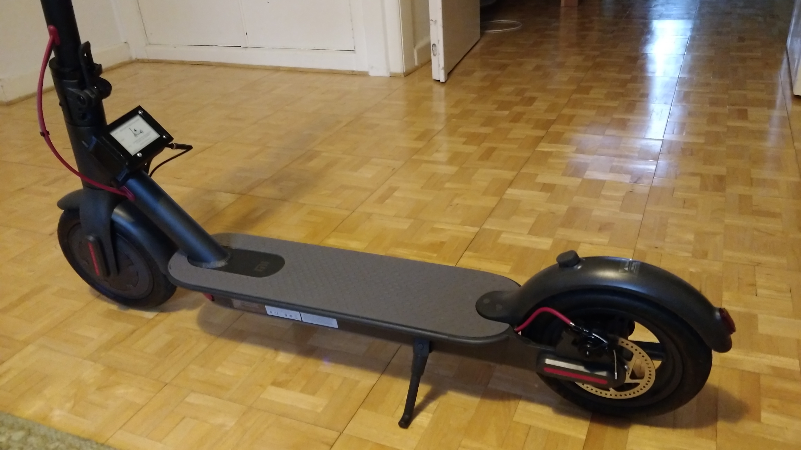
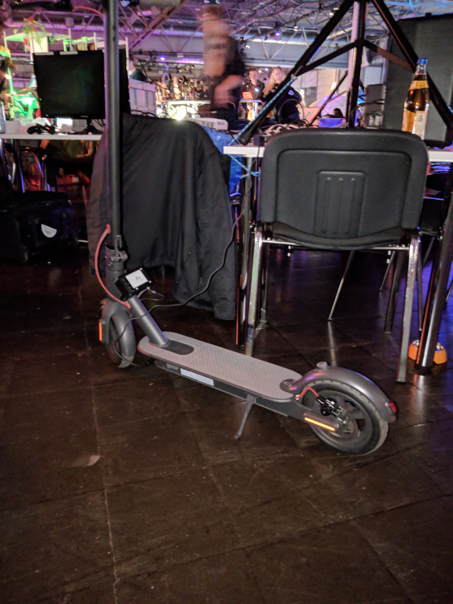
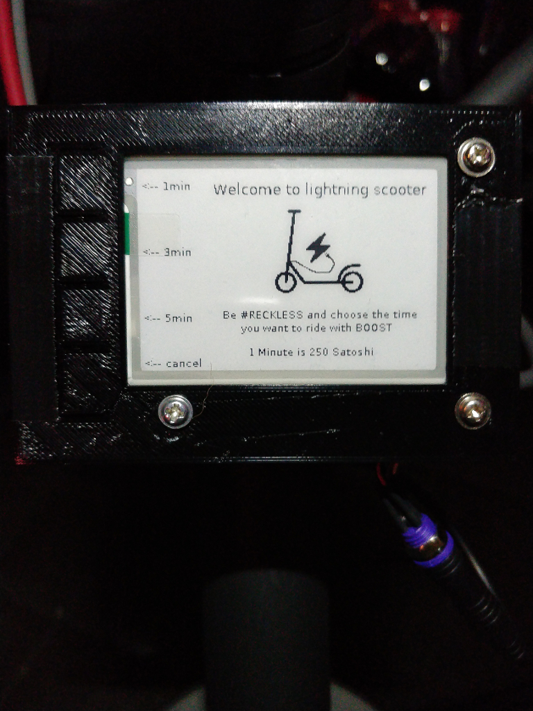
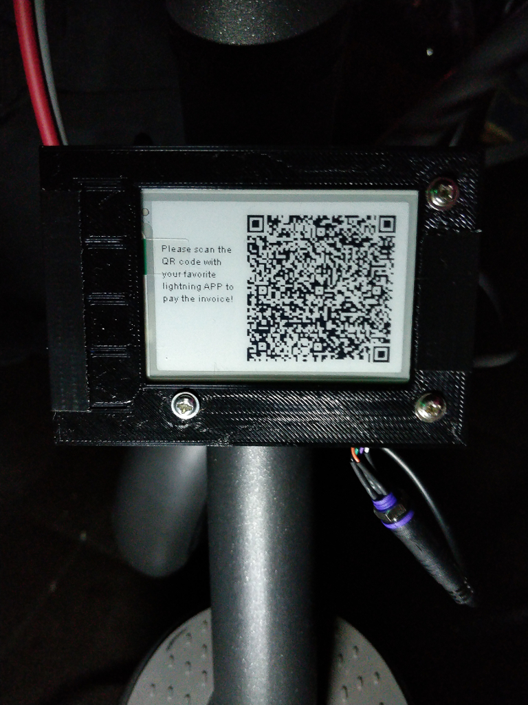

# ⚡lightning⚡ payable e-scooter

Der lightning-scooter ist ein e-scooter (Xiaomi m365) dessen elektrischer Antrieb man für einen bestimmten Zeitraum buchen kann. 
Es benutzt lightning als Zahlungssystem um diese Funktion zu aktivieren. Man wählt am Display aus wie lange man fahren möchte, 
bekommt einen qr-code generiert den man mit seiner Handy lightning APP scannt und bezahlt, woraufhin der Strom für den gewählten
Zeitraum eingeschaltet wird. Das besondere an diesem System, es ist mobil, d.h. die Kommunikation wird über das Mobilfunknetzt
realisiert und die Stromversorgung kommt aus den Akkus des e-scooter.   

## Wie funktioniert es?

Der Client baut nach dem Bootvorgang automatisch mit einem GSM/GPRS GPIO HAT eine Verbindung ins Internet auf. Das Programm startet
und das Display zeigt den Startbildschirm auf dem man momentan zwischen drei unterschiedlichen Zeiten der Benutzung wählen kann.
Pro Minute werden 250 satoshi verlangt. 

Der Kunde wählt den Zeitraum und das Programm generiert eine Zahlungaufforderung, die mittels lightning-charge an den node des
Servers übermittelt wird. Der Client bekommt die Zahlunginformationen vom Server zurück, generiert daraus einen qr-code welcher
dem Kunden auf dem Display angezeigt wird. Der Kunde hat nun 60 Sek. Zeit den qr-code mit seiner lightning APP im Handy zu scannen
und zu bezahlen. Solange testet der Client beim Server ob die Rechnung als bezahlt ausgewiesen wird.

Hat die Bezahlung funktioniert wird der Strom vom System für die gewählt Zeit eingeschaltet und man kann los fahren!!! 
Nach dem Ende der bezahlten Zeit schaltet das System ab und die Stromzufuhr wird unterbrochen - man kann natürlich weiter rollern,
aber nur noch mit Muskelkraft. Das Programm kehrt zum Startbildschirm zurück und man kann wieder neue Zeit buchen. Hat es nicht 
funktioniert, wird der Startbildschirm aufgerufen und man kann es nochmal probieren.

## Systemaufbau:

Herz des System ist ein Raspberry Pi Zero WH, welcher sowohl die Anbindung an das Mobilnetz als auch die Schaltung der 
Stromzufuhr duch Relais steuert. Als Monitor kommt ein e-paper Display zum Einsatz, welches praktischweise auch gleich 
4 Druckschalter für die Steuerung zur Verfügung stellt. Das e-paper Display habe ich genommen da es im Anzeigemodus so gut wie 
keinen Strom verbraucht eigentlich nur wenn sich der Bildinhalt ändert. Es hat einen hohen Kontrast ist auch an sonnigen Tage gut ablesbar. Der Bildaufbau ist zwar mit ca. 6 Sek. relativ zäh, aber es werden eigenlich nur 2 Schritte/Bilder
benötigt um den Bezahlvorgang zu erledigen.  

Auf der Serverseite gibt es einen Raspberry Pi 3B auf dem die Bitcoin Blockchain https://bitcoincore.org/ und ein auf c-lightning https://github.com/ElementsProject/lightning basierender lightning node installiert ist. Für die Steuerung des lightning nodes wird lightning-charge API https://github.com/ElementsProject/lightning-charge verwendet mit der sich sehr einfach die Programmierung der Bezahlungvorgänge umzusetzen ließ.

Auf der Clienseite habe ich darauf geachtet möglichst stromsparende Komponenten zu verwenden, deshalb viel meine Wahl 
auf einen raspberry Pi Zero WH mit einem e-paper Display. An
da gibt es vielleicht besseres. Das Relais zum Schalten des Stroms wird klassich über GPIO angesteuert und auch die 
4 Druckschalter des e-paper über GPIO abgefragt.

### Bauteile Server:
- Raspberry Pi 3
- 16GB microSD Karte
- Standardgehäuse schwarz
- microUSB Kabel
- Netzteil
- Netzwerkkabel

### Bauteile Client:
- Raspberry Pi Zero WH
- 16GB microSD Karte
- Waveshare 2.7inch E-Ink display 264x176 px 
- Waveshare GSM/GPRS/GNSS/Bluetooth HAT
  (prepaid von Tchibo :-) (Provider Netz O2)
- 2x 1 Kanal Relais 5V/230V
- Yeeco DC/DC Konverter 8-50V 12V/24V/36V/48V bis 5V3A / 15W Wasserdichter
- Selbst entworfenes Gehäuse aus PLA
- Kabel, Lötzinn, Heißkleber, Montageband usw.

## Zum e-scooter:

Ich habe einen Xiaomi m365 genommen, da er einer der beliebtesten scooter auf dem Markt ist und auch von kommerziellen e-scooter Vermieter eingesetzt wird.    

