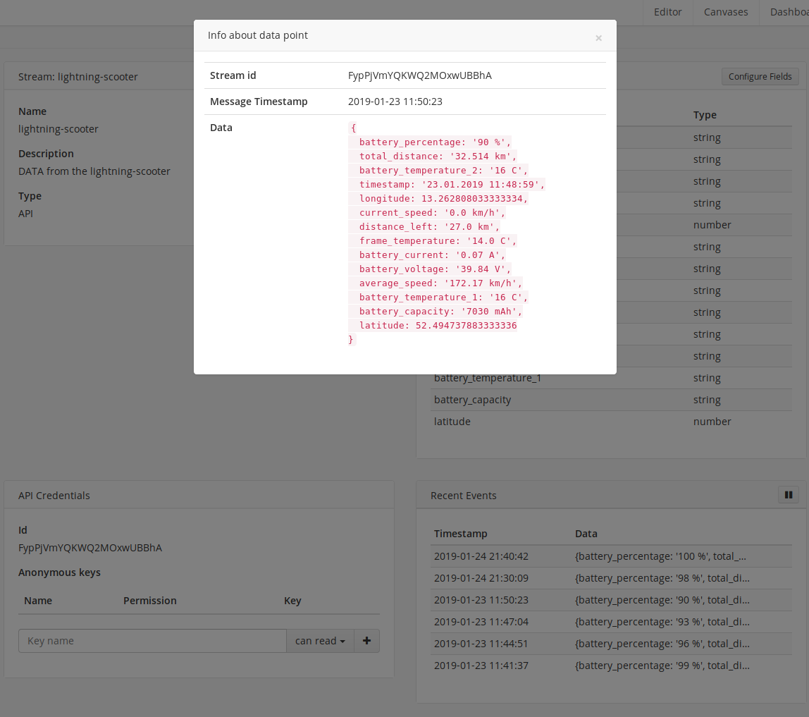
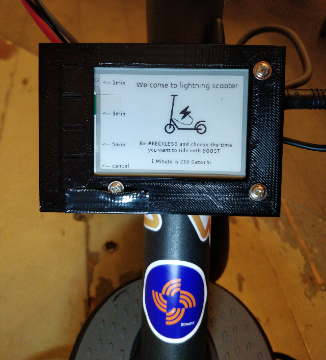
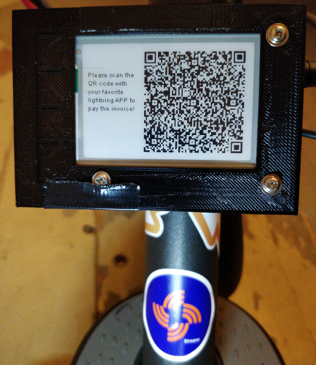
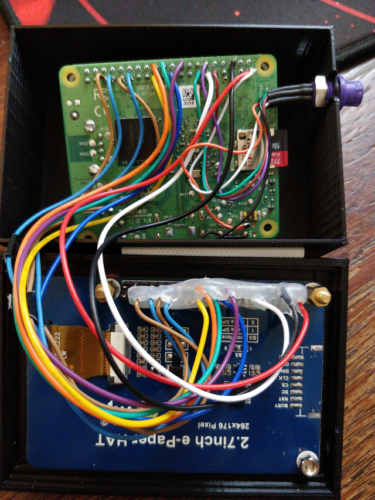

## ⚡lightning⚡ payable e-scooter mit [streamr](https://www.streamr.com/) support 

Der lightning-scooter ist ein e-scooter dessen elektrischen Antrieb man für einen bestimmten Zeitraum buchen kann. 
Für die Bezahlung wird Bitcoin Lightning verwendet. Man wählt am Display aus wie lange man fahren möchte, bekommt einen qr-code generiert den man z.B. mit einer Handy lightning APP scannt und bezahlt. Dann wird der Strom für den gewählten Zeitraum eingeschaltet und man kann den scooter benutzen. Das besondere an diesem System, es ist mobil, d.h. die Kommunikation wird vollständig über das Mobilfunknetzt realisiert.

Auf dem [35C3](https://events.ccc.de/category/congress/35c3/) habe ich den lightning-scooter zum mieten angeboten, er wurde sehr gut angenommen. 

Hier ein kleines Video vom Buchungsvorgang: 

## [streamr](https://www.streamr.com/):

Zusätzlich zu meinen vorherigen Projekt, dem [lightning-bike](https://github.com/leblitzdick/lightning-bike), gibt es beim lightning-scooter eine Integration mit [streamr](https://www.streamr.com/), einer open-source Plattform für den weltweiten Austausch von Echtzeitdaten. Es werden nun bei jedem Buchungsvorgang Daten über den lightning-scooter an das [streamr](https://www.streamr.com/) Netzwerk übermittelt u.a. Datum, Standort, Akku Ladezuustand und noch einiges mehr.

Es ist somit möglich die Nutzung des lightning-scooters zu dokumentieren und jederzeit online über die [streamr](https://www.streamr.com/) Platform Informationen über den scooter zu erhlaten.

Bei jedem neuen Mietevorgang werden folgende Informationen zu [streamr](https://www.streamr.com/) übertragen, im nächsten Bild kann man den Inhalt des streams sehen:

In einem Testlauf habe ich nun insgesamt 4x den scooter gemietet und dann 1 Minute gefahren, jedes mal wurden die Statusinformationen an [streamr](https://www.streamr.com/) übermittelt. Aus diesen Daten habe ich dann mit dem [streamr](https://www.streamr.com/) Editor ein canvas anlegt welches die Daten aus dem stream sammelt. Es nun möglich im canvas über das Map Modul die GPS Daten zu visualisieren, sodas man die Orte der Miete anzeigen kann. Da auch Datum und Uhrzeit erfaßt werden können nun z.B. Bewegungsprofile erzeugt werden. 

## Wie funktioniert es?

Der Client startet nach dem Bootvorgang automatisch das Programm auf dessen Startbildschirm man momentan zwischen drei unterschiedlichen Nutzungszeiten, 1,3 und 5 Minuten, wählen kann. Pro Minute werden 250 satoshi verlangt das sind ca. 0,01€. 

Der Kunde wählt nun die gewünschte Zeit der Miete und das Programm ermittel als erstes die genaue Position des scooters per GPS.  Danach werden aktuelle Status Daten des scooters per bluetooth ausgelesen. Es wird dann eine Internetverbindung hergestellt und die gesammelten Informationen werden an die [streamr](https://www.streamr.com/) Plattform übermittelt. 

Im zweiten Schritt wird eine Zahlungaufforderung (invoice) über den geforderten Betrag generiert, dieser wird mittels [lightning-charge](https://github.com/ElementsProject/lightning-charge) an den lightning node übermittelt. Der Client bekommt die Zahlunginformationen vom lightning node zurück und generiert daraus einen qr-code welcher dem Kunden auf dem Display angezeigt wird. 
Der Kunde hat nun 60 Sek. Zeit den qr-code mit seiner lightning APP im Handy zu scannen und dann zu bezahlen. Solange testet der Client beim lightning node ob die Rechnung als bezahlt markiert ist. 
Wird die Bezahlung innerhalb der 60 Sek. nicht bestätigt, werden die Daten verworfen und das Programm kehrt zum Startbildschirm zurück. Hier hat man dann die Möglichkeit den Vorgang zu wiederholen.

Hat die Bezahlung funktioniert wird der Strom vom System für die gewählt Zeit eingeschaltet und man kann los fahren!!! Nach dem Ende der bezahlten Zeit wird die Stromzufuhr unterbrochen und die Miete ist beendet - man kann natürlich weiter rollern, aber nur noch mit Muskelkraft. Das Programm kehrt zum Startbildschirm zurück und und ist bereit von neuem zu starten. 

## Systemaufbau:

Herz des System ist ein Raspberry Pi 3 A+, welcher durch einen GSM/GPRS/GNSS HAT ergänzt wird. Dieses Bauteil besitzt ein GSM und ein GPS Modul und ist somit sowohl für die Ortung als auch die Internetvebindung zuständig. 

Die Relais zur Steuerung der Stromzufuhr werden durch die GPIOs des Raspberrypi Pi angegesteuert. Mit dem bluetooth Modul werden die Informationen aus dem scooter ausgelesen. Hier habe ich den Programmcode aus diesem Repository [ReadM365](https://github.com/Emeryth/ReadM365) angepasst. 

Als Monitor kommt ein e-paper Display zum Einsatz, welches praktischweise auch gleich 4 Druckschalter für die Menüsteuerung zur Verfügung stellt. Diese werden ebenfalls über die GPIOs des Raspberry Pi abgefragt. Das e-paper Display hat den Vorteil das es im Anzeigemodus so gut wie keinen Strom verbraucht sondern nur wenn sich der Bildinhalt ändert. Es hat einen hohen Kontrast ist auch an sonnigen Tage gut ablesbar. Der Bildaufbau ist zwar mit ca. 6 Sek. relativ zäh, aber es werden eigenlich nur 2 Schritte/Bilder benötigt um den Bezahlvorgang zu erledigen.

Für die Stromzufuhr des Raspberry Pi war es nötig einen DC/DC Konverter zu verbauen der aus den 42V des Scooter Akkus die erforderlichen 5V bereitstellt. Im unteren Bild ist er zu sehen, damit der Konverter nicht den Akku entlädt ist ein Schalter verbaut der ihn vom Strom trennt. In diesem Bild sind auch die beiden blauen Relais zu erkennen welche für das schalten des Stroms zuständig sind. 

Hier kann man die Verkabelung erkennen die vom e-paper Display zu den Anschlüssen am Raspbery Pi gehen. Der Stecker am rechten Rand der oberen Gehäuseschale führt die Kontakte der Relais und den Strom des Paspberry Pi welche alle aus dem Boden des scooter's kommen.

Auf der Serverseite gibt es einen Raspberry Pi 3B auf dem der pseudo Node [sPRUNED](https://github.com/gdassori/spruned) die Bitcoin Blockchain vorhält und ein auf [c-lightning](https://github.com/ElementsProject/lightning) basierender lightning node. Für die Steuerung des lightning nodes wird die API [lightning-charge](https://github.com/ElementsProject/lightning-charge) verwendet mit ihr ließ sich sehr einfach die Programmierung der Bezahlungvorgänge umzusetzen.

Auf beide Raspberry Pi Systemen die aktuellen raspbian strech lite Distribution installiert. Das eigentlich Programm zur Steuerung des lightning-scooter ist in python2.7 geschrieben.

### Bauteile Server:
- Raspberry Pi 3 A+
- 16GB microSD Karte
- Standardgehäuse schwarz
- microUSB Kabel
- Netzteil
- Netzwerkkabel

### Bauteile Client:
- Raspberry Pi 3 A+
- 16GB microSD Karte
- [Waveshare 2.7inch E-Ink display 264x176 px](https://www.waveshare.com/2.7inch-e-paper-hat.htm) 
- [Waveshare GSM/GPRS/GNSS/Bluetooth HAT](https://www.waveshare.com/wiki/GSM/GPRS/GNSS_HAT) (Prepaid SIM card Provider Netz O2)
- 2x 1 Kanal Relais 5V/230V
- Yeeco DC/DC Konverter 8-50V 12V/24V/36V/48V bis 5V3A / 15W Wasserdichter
- Selbst entworfenes Gehäuse aus PLA
- Kabel, Lötzinn, Heißkleber, Montageband usw.

### Scooter:
 - [Xiaomi M365](https://www.mi.com/global/mi-electric-scooter/)

