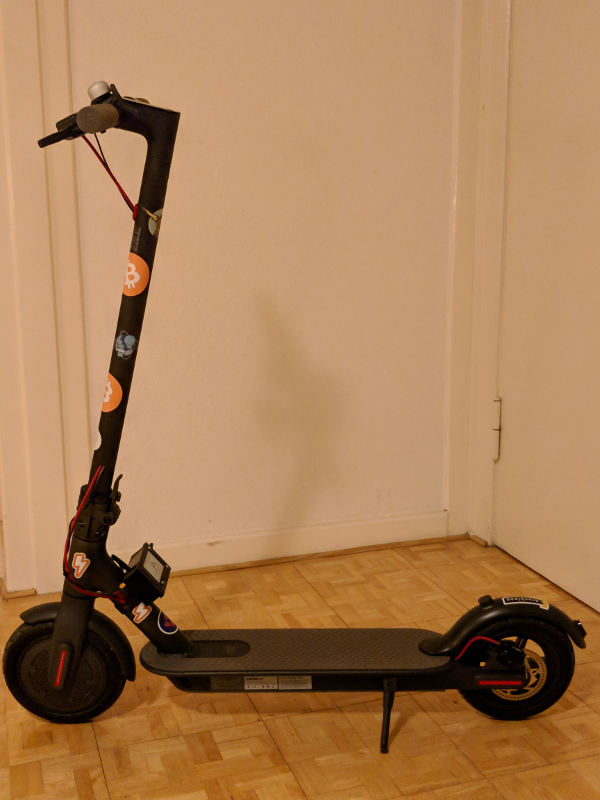
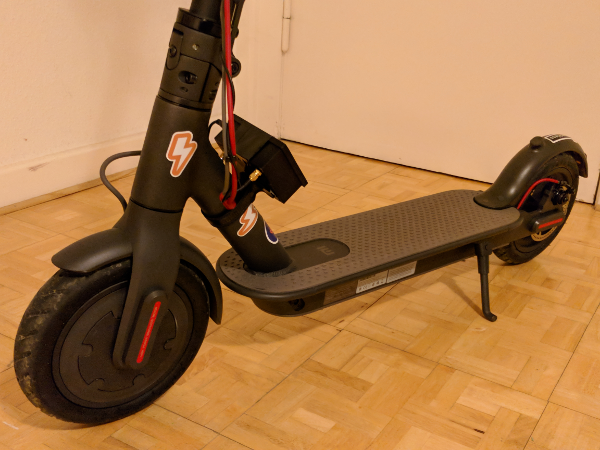
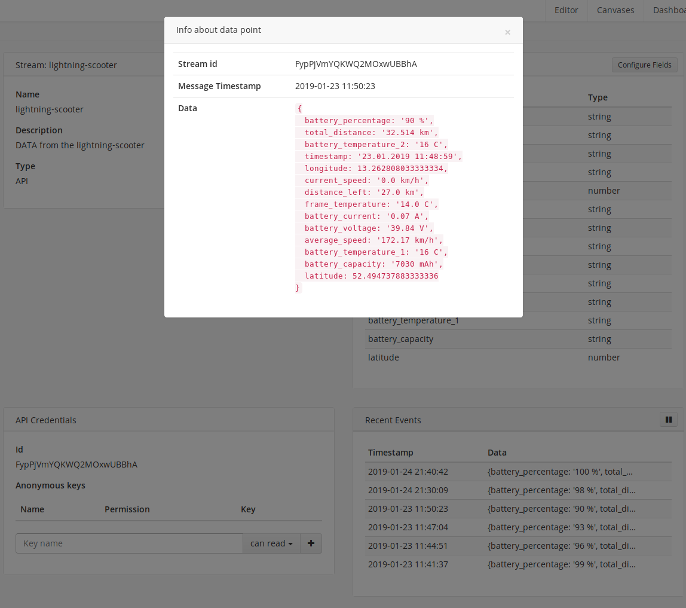
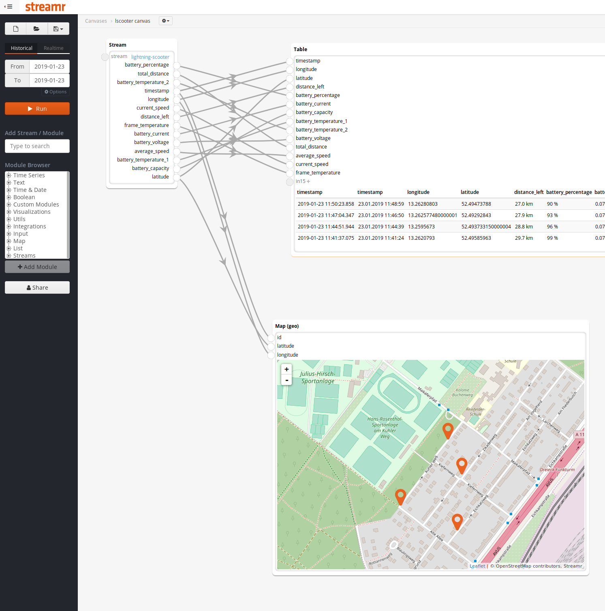
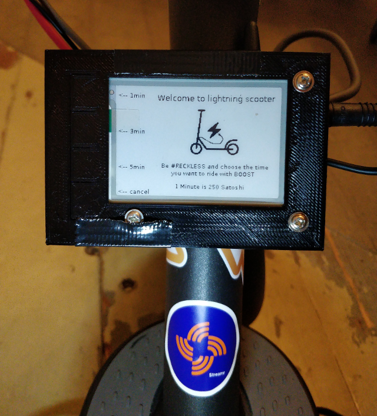
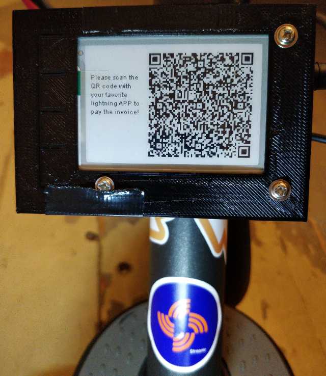
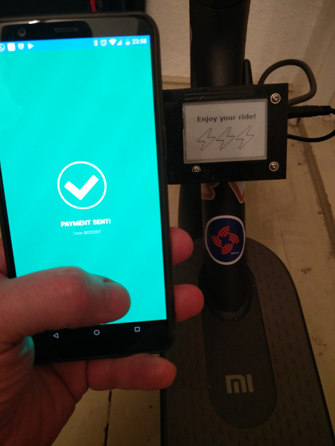
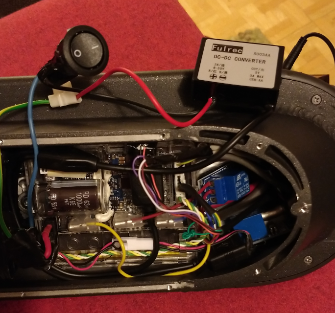
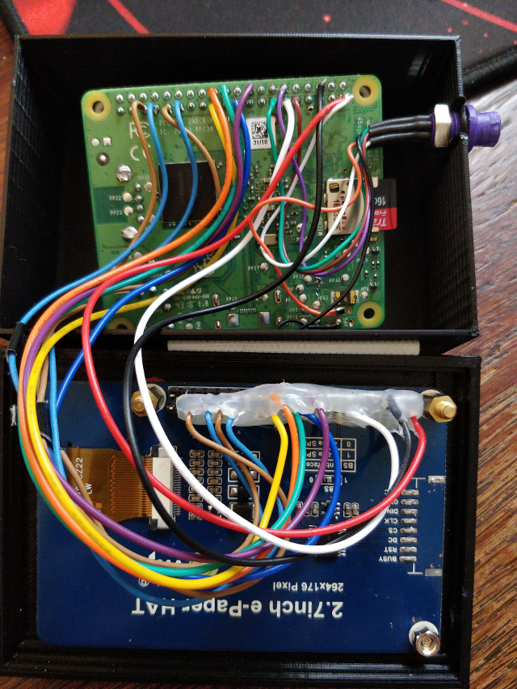

## ⚡lightning⚡ payable e-scooter

The lightning-scooter is an e-scooter whose electric drive can be booked for a certain period of time. For the payment Bitcoin
Lightning is used. You choose on the display how long you want to drive, get a qr-code generated which you scan with a mobile 
phone lightning APP and pay. Then the power is switched on for the selected period and you can use the scooter. The special 
thing about this system is that it is mobile, i.e. the communication is completely realized via the mobile network.

On the [35C3](https://events.ccc.de/category/congress/35c3/) I offered the lightning-scooter for rent, it was a great success.

Here is a small video of the booking process:

##  [streamr](https://www.streamr.com/):

In addition to my previous project, the [lightning-bike](https://github.com/leblitzdick/lightning-bike), the lightning-scooter
has an integration with [streamr](https://www.streamr.com/), an open-source platform for the worldwide exchange of real-time 
data. Now every time you make a booking, data about the lightning-scooter is transmitted to the 
[streamr](https://www.streamr.com/) network, including date, location, battery charge status and much more.

It is thus possible to document the use of the lightning-scooter and to receive information about the scooter online via the 
[streamr](https://www.streamr.com/) platform at any time.

The following information is transferred to streamr during every new rental process, in the next picture you can see the content
of the stream:

In a test run I rented the scooter 4 times and then drove 1 minute, each time the status information was sent to [streamr](https://www.streamr.com/). From this data I created a canvas with the [streamr](https://www.streamr.com/) editor which collects
the data from the stream. It is now possible to visualize the GPS data in the canvas via the map module, so that the locations 
of the rent can be displayed. Since also date and time can be captured now e.g. motion profiles can be generated.

## How does it work?

After the boot process, the client automatically starts the program on whose start screen you can currently choose between three
different usage times, 1, 3 and 5 minutes. The costs per minute are 250 satoshi that is approx. 0.01€.

The customer now selects the desired rental time and the program first determines the exact position of the scooter via GPS.
Then the current status data of the scooter is read out via Bluetooth. An internet connection is then established and the
collected information is transmitted to the [streamr](https://www.streamr.com/) platform.

In the second step, an invoice is generated for the requested amount, which is transmitted to the lightning node via [lightning-charge](https://github.com/ElementsProject/lightning-charge). The client gets the payment information back from the lightning
node and generates a qr-code which is shown to the customer on the display.

The customer now has 60 seconds to scan the qr-code with his lightning APP in his mobile phone and then pay th invoice. During
this time the client tests the lightning node to see if the invoice is marked as paid.

If the payment is not confirmed within 60 seconds, the data is discarded and the program returns to the start screen. Here you
have the possibility to repeat the process.

If the payment has worked, the Internet connection will be disconnected and the system will turn on the power for the selected
time. The scooter is now ready to go! After the end of the paid time the power supply is interrupted and the rent is finished -
of course it rolls on, but only with muscle power. The program returns to the start screen and is ready for a new rental 
process.

## System structure:

The heart of the system is a Raspberry Pi 3 A+, which is supplemented by a GSM/GPRS/GNSS HAT. This component has a GSM and a GPS
module and is therefore responsible for the positioning as well as the Internet connection.

The relays for controlling the power supply are controlled by the GPIOs of the Raspberrypi Pi. The Bluetooth module reads the
information from the scooter. Here I have adapted the program code from this repository [ReadM365](https://github.com/Emeryth/ReadM365).

An e-paper display is used as monitor, which also provides 4 switches for the menu control. These are also queried via
the GPIOs of the Raspberry Pi. The e-paper display has the advantage that it consumes almost no power in display mode but only
when the image content changes. It has a high contrast and is easy to read even on sunny days. The picture construction is 
relatively tough with approx. 6 sec., but only 2 steps/pictures are needed to complete the payment process.

For the power supply of the Raspberry Pi it was necessary to install a DC/DC converter which provides the required 5V from the 
42V of the scooter battery. In the lower picture you can see it, so that the converter does not discharge the battery, a switch
is installed which separates it from the current. In this picture you can also see the two blue relays which are responsible for switching the main power. 

Here you can see the wiring going from the e-paper display to the connectors on the Raspbery Pi. The connector on the right side
of the upper shell leads the contacts of the relays and the current of the Paspberry Pi, which all come from the bottom of the 
scooter.

On the server side there is a Raspberry Pi 3B on which the pseudo node [sPRUNED](https://github.com/gdassori/spruned) provides the Bitcoin blockchain and a [c-lightning](https://github.com/ElementsProject/lightning) based lightning node. For the control of the lightning node the API [lightning-charge](https://github.com/ElementsProject/lightning-charge) is used because it's very easy to implement the payment processes.

The current raspbian strech lite distribution is installed on both Raspberry Pi systems. The program code to control the lightning-scooter is written in python.

### Components Server:

- Raspberry Pi 3 A+
- 16GB microSD card
- standard case
- microUSB cable
- power supply
- network cable

### Components Client:

- Raspberry Pi 3 A+
- 16GB microSD card
- [Waveshare 2.7inch E-Ink display 264x176 px](https://www.waveshare.com/2.7inch-e-paper-hat.htm)    
- [Waveshare GSM/GPRS/GNSS/Bluetooth HAT](https://www.waveshare.com/wiki/GSM/GPRS/GNSS_HAT) (Prepaid SIM card Provider Network O2)
- 2x 1 channel relay 5V/230V
- Yeeco DC/DC Converter 8-50V 12V/24V/36V/48V to 5V3A / 15W Watertight
- Self-designed case made of PLA
- Cable, solder, hot glue, mounting tape, etc.

### Scooter:

- [Xiaomi M365](https://www.mi.com/global/mi-electric-scooter/)
